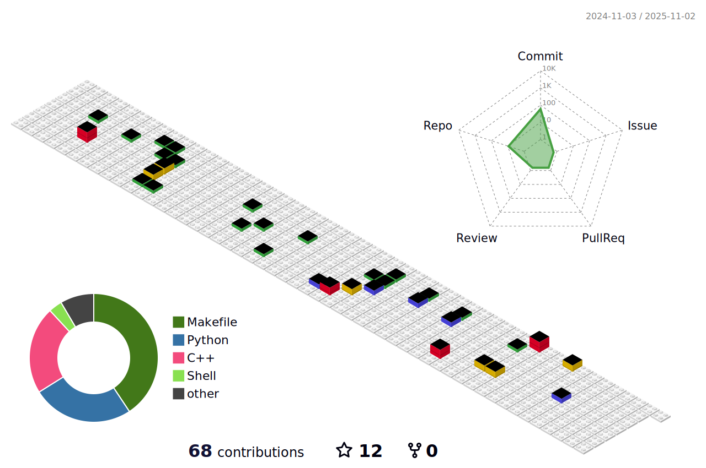

## Stats

<!---->

## Career😄

- [2017~2024] Jeonbuk National University Department of Mechanical Engineering
- [2022~2023] DRoC Lab, Undergraduate research students
- [2023~2024] Integrated Major in Future Automotive Engineering
- [2023~now]  AIR Lab

## Award history

- [2022] Hanium ICT Contest (Self-driving air purifier) :: Silver Award
- [2023] Jeonbuk National University, Self-Design Contest (4-DOF cooperative robot) :: Grand Prize Award
- [2023] Jeonbuk National University, Capston Design Contest (Omni-directional mobile manipulator for tomato harvesting) :: Bronze Prize

## SNS

<!--

**Hyounjun-Oh/hyounjun-oh** is a ✨ _special_ ✨ repository because its `README.md` (this file) appears on your GitHub profile.

Here are some ideas to get you started:

- 🔭 I’m currently working on ...
- 🌱 I’m currently learning ...
- 👯 I’m looking to collaborate on ...
- 🤔 I’m looking for help with ...
- 💬 Ask me about ...
- 📫 How to reach me: ...
- 😄 Pronouns: ...
- ⚡ Fun fact: ...
-->
